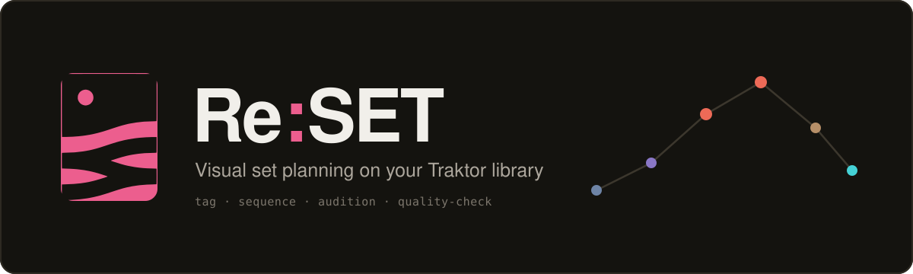

<p align="center">
  
</p>

<p align="center">
  <strong>Visual, cover-first set planning that sits on top of your Traktor Pro&nbsp;4 library.</strong><br />
  Tag by energy and vibe, sequence with harmonic compatibility, audition, and check audio quality — all local-first.
</p>

<p align="center">
  
  
  
  
  
</p>

---

Re:SET is the prep layer **before** Traktor — not a replacement. You organize, tag, and arrange your
sets visually here, then export them (`.m3u` today, Traktor playlist write-back planned) into the
software you actually play with. Your audio files and Traktor's collection are never modified.

## Why

Planning a set out of folders is slow, and Traktor's tiny cover thumbnails make digging painful.
Re:SET turns the library into a visual workspace: big cover art, multi-dimensional tags instead of
rigid folders, and three ways to *see* a set come together.

## Features

**Organize**
- Reads your Traktor `collection.nml` (or import a folder of audio with real cover art).
- Multi-dimensional tagging: energy (1–10), phase (pre / mid / peak / late), free vibe tags.
- Search, sort, batch-tagging, and rule-based **smart crates** that update themselves.
- **Health** view: missing keys/BPM/cover, duplicate detection, and library distributions.

**Plan**
- **Cover Wall** — a large, filterable grid of cover art.
- **Energy Timeline** — the set laid out as an energy curve with phase zones; one-click harmonic
  auto-order, and drag a tile up/down to set its energy.
- **Set Canvas** — a freeform board with phase zones and compatibility lines.
- Live compatibility scoring (harmonic key + tempo + energy) on every transition.

**Quality** (for live sets)
- Optional `ffmpeg` deep-scan flags **low bitrate**, **clipping**, **suspected transcodes**
  (fake high-bitrate files), and **loudness outliers** — the things that fall apart on a club PA.

**Built for flow**
- Persistent waveform mini-player that keeps playing while you browse.
- Undo/redo, keyboard shortcuts, feedback toasts.

## Tech stack

| Layer | Choice |
| --- | --- |
| UI | React 19 + TypeScript, Vite, Tailwind CSS v4 |
| Audio | wavesurfer.js (preview), `ffmpeg` + `music-metadata` (import/analysis) |
| Icons | Phosphor |
| Persistence | localStorage today → SQLite with the Tauri shell |
| Desktop (planned) | Tauri (Rust core) for filesystem write-back to Traktor |

## Getting started

### Prerequisites

- Node ≥ 20
- `ffmpeg` in your `PATH` (optional — only for the quality deep-scan)

### Install & run

```bash
npm install
npm run dev          # http://localhost:5173
```

Other scripts: `npm run build`, `npm run typecheck`, `npm run preview`.

### Load your own library

The app prefers `public/collection.local.nml`, falling back to the bundled sample.

```bash
# Import a folder of audio (metadata + embedded cover art)
npm run import:music -- "/path/to/your/music"

# …with the audio-quality deep-scan (LUFS / true-peak / HF cutoff via ffmpeg)
npm run import:music -- "/path/to/your/music" --deep
```

Or copy a real Traktor `collection.nml` to `public/collection.local.nml` to use your full,
analyzed library (BPM/keys included). Imported `covers/`, `audio/`, and the local `.nml` are
git-ignored and stay private.

## Keyboard shortcuts

| Key | Action |
| --- | --- |
| `⌘Z` / `⌘⇧Z` | Undo / redo |
| `1`–`4` | Set phase (pre / mid / peak / late) on the selected track |
| `0` | Clear phase |
| `+` | Add selected track to the set |
| `Space` | Audition the selected track |
| `/` | Focus search |
| `?` | Shortcut help |

## Project structure

```
src/
  lib/        nml parser, camelot, compatibility, quality, autoorder, store
  components/ cover wall, timeline, canvas, inspector, set panel, health, …
scripts/
  import-music.mjs   folder → collection.local.nml (+ covers, audio, quality)
docs/         logo & banner assets
```

## Roadmap

See [ROADMAP.md](ROADMAP.md). The headline remaining work is the **Tauri desktop shell + write-back**
to Traktor (backup-first, dry-run) — turning the planner into an installable app.

## Design & docs

- [PFLICHTENHEFT.md](PFLICHTENHEFT.md) — full specification and the locked design system (tokens,
  typography, motion).
- [AGENTS.md](AGENTS.md) — setup, conventions, and safety rules for AI coding agents.

## License

[MIT](LICENSE) © SmvHutchy
